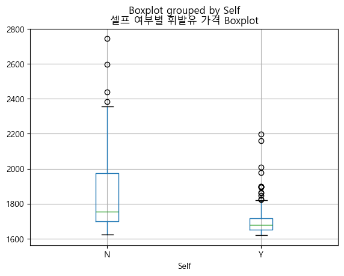
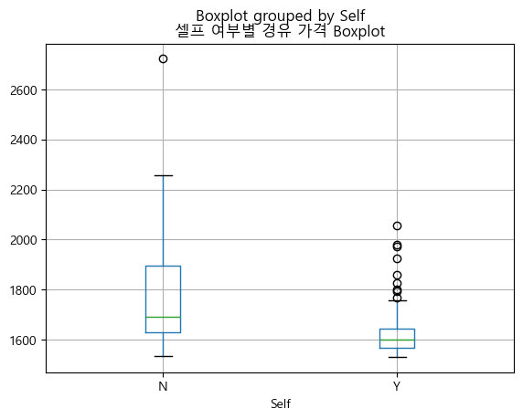
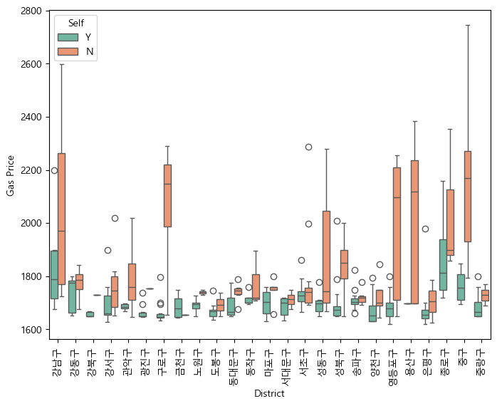
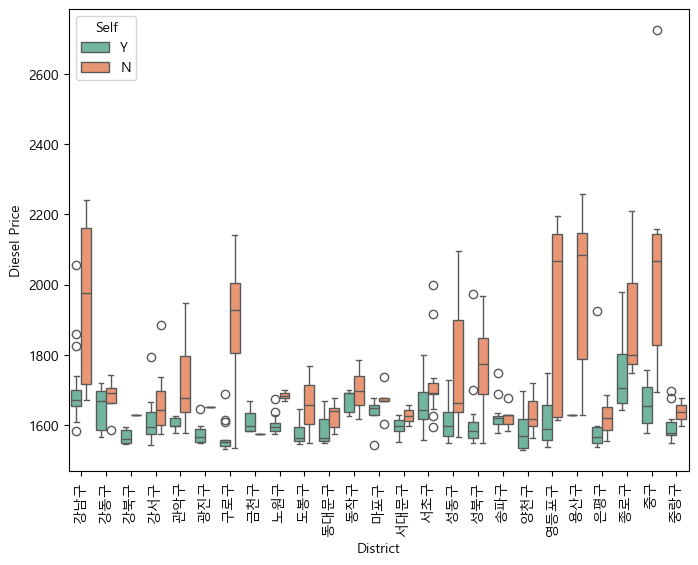
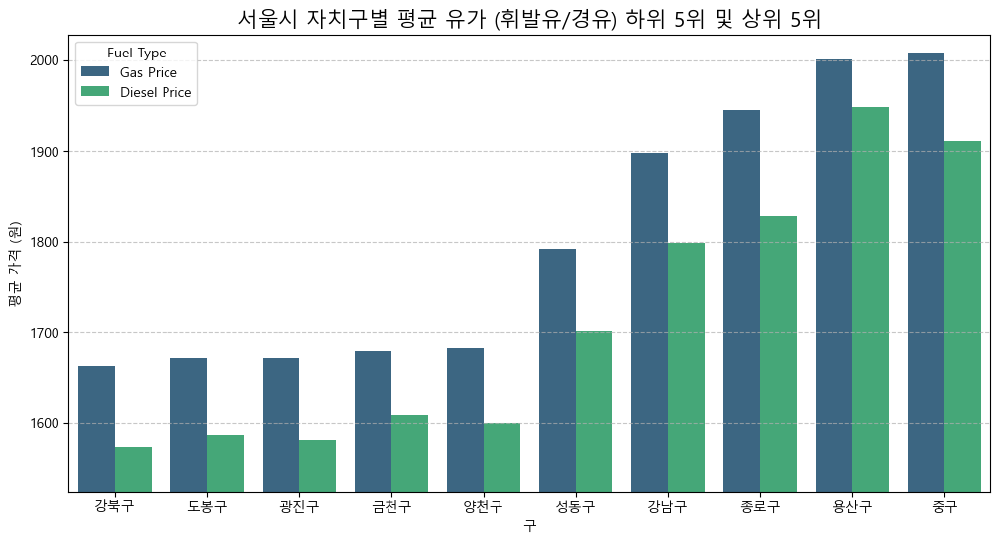
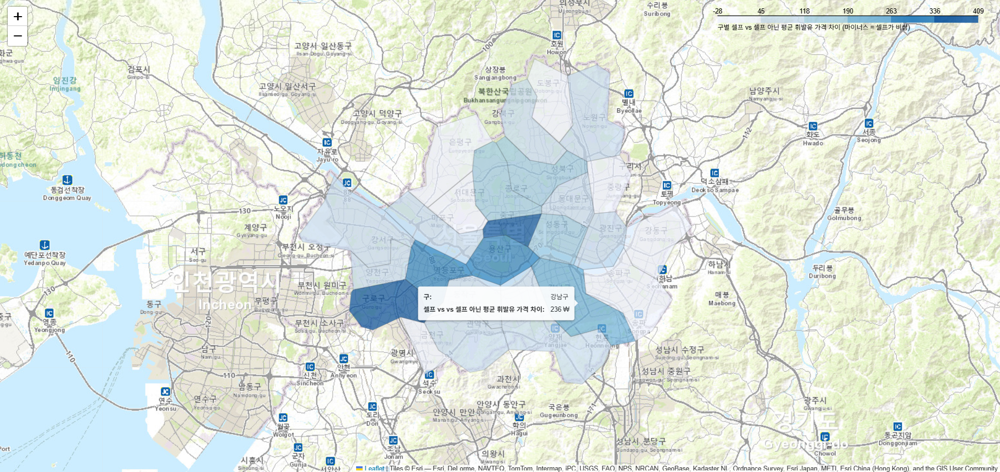
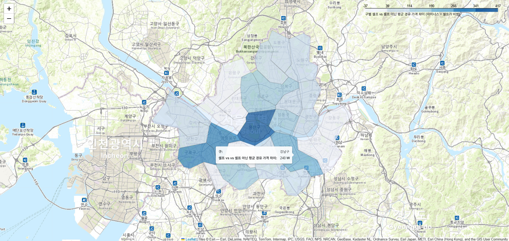

# ⛽ 서울시 주유소 유가 분석 및 셀프 주유소 경제성 검정

## 0. 🥅 프로젝트 개요 (Overview)
본 프로젝트는 **"셀프 주유소는 실제로 일반 주유소보다 저렴한가?"**라는 질문에 대해 서울시 내 400여 개 주유소 데이터를 활용하여 통계적으로 해답을 제시합니다. 단순한 평균 비교를 넘어, 정규성 및 등분산성 검정을 거친 엄격한 가설 검정(Welch's t-test)을 통해 데이터 기반의 결론을 도출했습니다.

## 1. 🛠 기술 스택 (Tech Stack)
- **Data Collection:** Selenium, BeautifulSoup4 (동적 웹 크롤링)
- **Data Analysis & Statistical Hypothesis Testing:** Pandas, Numpy, Scipy (Welch's t-test, Shapiro-Wilk, Levene)
- **Geocoding & Mapping:** Folium, Google Maps API (Geocoding)
- **Visualization:** Seaborn, Matplotlib

## 2. ⚙️ 핵심 워크플로우 (Methodology and Insights)
### Phase 1: 하이브리드 데이터 로드 전략 (Hybrid Data Collection)
- **Web Crawling:** `Selenium`을 활용한 자동화 실시간 크롤링 기능을 제공하여 데이터 수집 기술 역량을 증명했습니다.
- **Efficiency:** 재현성을 위해 웹 크롤링 없이도 즉시 분석이 가능하도록 정제된 데이터셋(`data/seoul_gas_station_data_full.csv`)을 제공합니다.

### Phase 2: 데이터 전처리 및 EDA (Preprocessing & EDA)
- **Data Type & Geocoding:** 가격 데이터를 수치형으로 변환하고, 주소 기반의 '구' 정보 추출 및 `Google Maps API`를 활용한 위경도 좌표 변환 (Geocoding)을 수행했습니다.
- **EDA:** 데이터 특성을 Boxplot, Bar Chart, Choropleth 등 다양한 시각화를 통해 파악했습니다.

### Phase 3: 통계적 가설 검정 (Statistical Hypothesis Testing)
단순 평균 비교의 오류를 범하지 않기 위해 엄격한 통계 절차를 거쳤습니다.
- **Testing Method:** 데이터의 분포 특성을 고려하여 Shapiro-Wilk(정규성) 검정 선행했습니다. 그 검정 결과, 표본은 다 정규 분포를 따르지 않았어도 표본 크기가 **중심극한정리 (Central Limit Theorem)** 의 임계값보다 커서 단측 독립표본 T-test도 가능했을 거라고 판단했지만 Levene(등분산성) 검정 결과, 표본 간 분산이 다름을 확인하여 **단측 Welch's t-test** 를 수행해야 한다고 판단했습니다.
- **Result:** $p < 0.05$ 수준에서 "셀프 주유소가 일반 주유소보다 통계적으로 유의미하게 저렴하다"는 결론을 도출하여 가설을 입증했습니다.

## 3. 📊 핵심 시각화 및 인사이트 (Important Visualizations & Insights)
### 1. 서울시 셀프 여부별 유가 분포 비교 (Boxplot)
 
- **인사이트:** 셀프 주유소의 가격 사분위수가 일반 주유소보다 명확히 낮게 형성되어 있음을 확인했습니다. 이는 통계적 유의성을 시각적으로 뒷받침하는 첫 번째 근거입니다.

### 2. 25개 자치구별 셀프/일반 가격 상세 분포 (District Boxplot)
 
- **인사이트:** 서울 전체적으로는 셀프가 저렴하지만, **금천구** 와 같이 셀프 주유소가 오히려 더 비싼 특이 구간을 발견했습니다. 이는 지역별 경쟁 환경이 가격 책정에 변수로 작용함을 시사합니다.

### 3. 유가 상/하위 5개 자치구 평균 비교 (Bar Chart)

- **인사이트:** 최고가 지역(중구, 용산구 등)과 최저가 지역(강북구, 도봉구 등)의 격차가 셀프 여부로 발생하는 차이보다 큼을 확인했습니다. 즉, **"어디서 주유하는가"** 가 **"어떻게(셀프 여부) 주유하는가"** 만큼 중요합니다.

### 4. 자치구별 셀프-일반 가격 편차 히트맵 (Folium Choropleth)
 
- **인사이트:** 강남구, 중구 등 고가 지역일수록 셀프와 일반 주유소 간의 가격 격차가 크게 벌어지는 경향을 확인했습니다. (결과물: `maps/gas_price_choropleth.html`)

### 5. 통계적 가설 검정 결과 요약 (Statistical Test Summary)
| 검정 항목 | 통계량 (Statistic) | p-value | 결론 |
| :--- | :--- | :--- | :--- |
| 셀프 휘발유 Shapiro-Wilk (정규성) | 0.74 | 0.00 < 0.05 | 비정규 분포 (CLT 적용) |
| 셀프 아닌 휘발유 Shapiro-Wilk (정규성) | 0.79 | 0.00 < 0.05 | 비정규 분포 (CLT 적용) |
| 셀프 경유 Shapiro-Wilk (정규성) | 0.80 | 0.00 < 0.05 | 비정규 분포 (CLT 적용) |
| 셀프 아닌 경유 Shapiro-Wilk (정규성) | 0.82 | 0.00 < 0.05 | 비정규 분포 (CLT 적용) |
| 셀프 여부 휘발유 가격 표본 Levene (등분산성) | 70.42 | 0.00 < 0.05 | 등분산성 위배 |
| 셀프 여부 경유 가격 표본 Levene (등분산성) | 78.33 | 0.00 < 0.05 | 등분산성 위배 |
| **셀프 여부 휘발유 Welch's t-test** | **-7.59** | **2.32e-12 < 0.001** | **유의미한 차이 있음 (가설 입증)** |
| **셀프 여부 경유 Welch's t-test** | **-8.12** | **1.17e-13 < 0.001** | **유의미한 차이 있음 (가설 입증)** |

- **인사이트:**
  - **정규성 검정 (Shapiro-Wilk):** 비정규 분포 확인 ($p < 0.05$). 그러나 표본 크기($N > 30$)가 충분하여 **중심극한정리(CLT)**를 근거로 t-test를 수행할 수 있다고 검증했습니다.
  - **등분산 검정 (Levene):** 두 집단의 분산이 다름을 확인하여 단측 독립표본 t-test 대신 Welch’s t-test 수행해야 한다고 판단했습니다.
  - **최종 검정 (Welch’s t-test):** 단측 검정 결과 $p < 0.05$로 나타나, **"서울시 셀프 주유소는 유의미하게 저렴하다"**는 대립가설을 채택했습니다.

## 4. 💡 결론 및 비즈니스 영향 (Conclusions & Business Impact)
- **통계적 의사결정:** Welch's t-test를 통해 서울시 내 셀프 주유소가 통계적으로 유의미하게 저렴함을 입증했습니다. 이는 소비자에게 '셀프 주유'가 실질적인 비용 절감 수단이 됨을 데이터로 증명한 것입니다.
- **지역적 특수성 고려:** 하지만 금천구와 같은 특정 지역에서는 셀프 주유소가 오히려 더 비싼 '가격 역전 현상'이나, 일부 자치구의 '가격 하향 평준화(Price Convergence)' 경향이 확인되었습니다.
- **비즈니스 인사이트:** 운송업체나 일반 운전자는 단순히 '셀프 여부'만 따지기보다, 자치구별 가격 편차를 우선적으로 고려해야 합니다. 특히 고가 지역(중구, 강남구 등)에서는 셀프와 일반 주유소의 가격 격차가 크므로 셀프 이용의 경제적 유인이 극대화되지만, 저가 지역이나 특정 예외 지역에서는 인근 일반 주유소를 이용하는 것이 시간 대비 효율적일 수 있습니다.

--
## **💻 실행 가이드 (How to Run)**

**1. 라이브러리 설치**
```bash
pip install -r requirements.txt
```

**2. API 키 설정 (필수)**
- 본 프로젝트는 Google Maps API를 사용합니다. 노트북 내 gmaps_key 변수에 본인의 API 키를 입력해야 지오코딩 및 지도 시각화가 정상 작동합니다.
- API 키가 없는 경우나 웹 크롤링을 생략하려면 데이터 로드 섹션에서 제공된 `data/seoul_gas_station_data_full.csv`를 바로 사용할 수 있습니다.

**3. 분석 실행**
- `Seoul_Gas_Station_EDA_Stats_Hypothesis_Testing.ipynb`를 실행합니다.

**4. 인터랙티브 지도 확인**
- `maps/` 폴더 내의 HTML 파일들을 브라우저로 열어 자치구별 상세 유가 지도를 확인할 수 있습니다.

--
## 📁 폴더 구조 (Project Structure)
```text
.
├── Seoul_Gas_Station_EDA_Stats_Hypothesis_Testing.ipynb # 메인 분석 및 가설 검정 노트북
├── README.md                                            # 프로젝트 상세 설명서
├── requirements.txt                                     # 프로젝트 실행을 위한 라이브러리 목록
├── .gitignore                                           # Git 업로드 제외 설정 (API Key, 캐시 등)
├── data/
│   ├── seoul_gas_station_data_full.csv                  # 웹 크롤링 및 전처리가 완료된 분석용 데이터
│   └── skorea_municipalities_geo_simple.json            # 지도 시각화(Choropleth)를 위한 서울시 행정구역 경계 데이터
├── maps/
│   ├── gas_prices_seoul_map.html                        # 휘발유 가격 차이 시각화 인터랙티브 지도
│   └── diesel_prices_seoul_map.html                     # 경유 가격 차이 시각화 인터랙티브 지도
└── images/
    ├── gas_self_boxplot.png                             # 휘발유 셀프/일반 가격 비교 그래프
    ├── diesel_self_boxplot.png                          # 경유 셀프/일반 가격 비교 그래프
    ├── gas__district_self_boxplot.png                   # 휘발유 구별 셀프/일반 가격 비교 그래프
    ├── diesel_district_self_boxplot.png                 # 경유 구별 셀프/일반 가격 비교 그래프
    ├── most_least_expensive_districts_barchart.png      # 휘발유 및 경유 평균 가격 상/하위 5위 자치구 막대차트
    ├── gas_prices_self_advantage_choropleth.png         # 자치구별 휘발유 셀프-일반 가격 편차 히트맵
    └── diesel_prices_self_advantage_choropleth.png      # 자치구별 경유 셀프-일반 가격 편차 히트맵

```